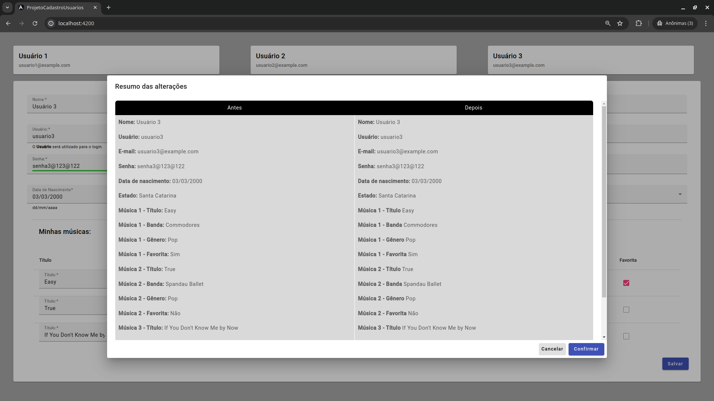

# ProjetoCadastroUsuarios

This project was generated with [Angular CLI] version 16.1.4.

## Development server

Run `ng serve` for a dev server. Navigate to `http://localhost:4200/`. The application will automatically reload if you change any of the source files.

## Code scaffolding

Run `ng generate component component-name` to generate a new component. You can also use `ng generate directive|pipe|service|class|guard|interface|enum|module`.

## Development server

Run `ng serve` for a dev server. Navigate to `http://localhost:4200/`.

## Build

Run `ng build` to build the project. The build artifacts will be stored in the `dist/` directory.

## Interface gráfica

